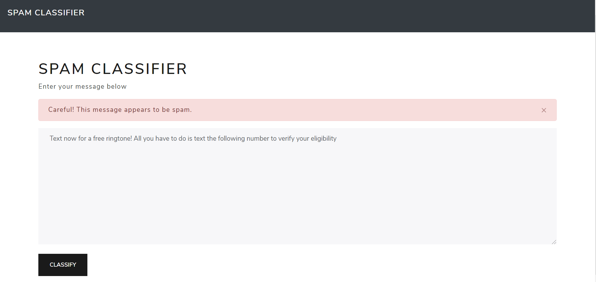

# Spam Classification App
Built with [Flask](https://flask.palletsprojects.com/), powered by [Scikit-Learn](https://scikit-learn.org/), and styled via [Bootstrap](https://getbootstrap.com/).

## Prerequisites
Make sure that you have the following:
* Python 3+ and pip (which comes with Python 3+)
* A Unix command line (e.g. Git Bash).

## Running the App
What each file does:
* `server.py` - runs the server and loads the user interface.
* `templates/layout.html` - contains the base HTML
* `templates/index.html` - contains the body of the HTML
* `models/saved/` - contains all locally saved models and dataframes for future loading
* `models/save_df.py` - cleans the dataframe and saves the new dataframe to local file structure.
* `models/model.py` - builds and saves the logistic regression model.

To run the app, complete the following steps:
1. Make sure you have Python 3 and a text editor installed.
2. Install the `virtualenv` package using `pip install virtualenv`.
3. Install the required packages using `pip install -r requirements.txt`. You can manually install them as you come across them if need be, but this will install them all for you. Note that if you add more packages, run `pip freeze > requirements.txt` to save them to your requirements file.
4. Create a virtual environment using `virtualenv <environment-name>` and start it using `source ./<environment-name>/Scripts/activate`. Note that the activate script directory might change depending on your operating system.
5. Run the `models/save_df.py` file. This will save the cleaned dataframe as a csv under the `models/saved` directory.
6. Run the `models/model.py` file. This will build the model and save it as a `.joblib` file under the `models/saved` directory. 
7. Run the `server.py` file. Make sure that the `saved/` directory contains both the `dataframe.csv` and `model.joblib` files.
